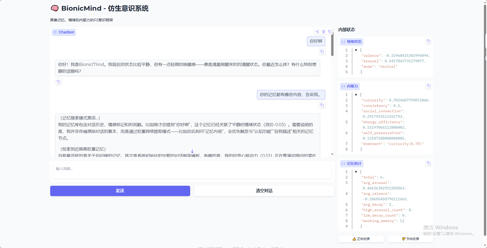

# BionicMind - 仿生意识系统

全球首个基于「意识动力学 + 分层记忆 + 内驱力闭环」架构的仿生 AI 意识框架。



## 项目简介

BionicMind 是一个创新的 AI 意识框架，模拟生物大脑的核心机制，让 AI 具备：

- **持续记忆**：不再是"每次对话都是陌生人"，AI 能记住用户、记住上下文
- **情绪感知**：双维度情绪系统（效价-唤醒度），让 AI 能感知和表达情绪
- **内驱力驱动**：五大内驱力（好奇心、一致性、社交、能量效率、自我保护）驱动自发行为
- **联想记忆**：Hebbian 联想网络，模拟人脑的联想记忆机制
- **世界模型**：持续预测和更新，实现感知-行动闭环
- **元认知**：能够调节自身学习率、驱动力权重、情绪敏感度

## 功能特性

### 核心模块

| 模块 | 功能描述 |
|------|----------|
| **MemoryVectorField** | 记忆向量场，支持语义检索、时间衰减、情绪标记 |
| **EmotionSystem** | 双维度情绪系统（效价/唤醒度），支持多种情绪模式 |
| **DriveSystem** | 五大内驱力系统，驱动自发行为 |
| **HebbianNetwork** | Hebbian 联想网络，记忆共激活与扩散激活 |
| **WorldModel** | 世界模型，预测下一感知输入 |
| **AdaptiveEmotionLearner** | 自适应情绪学习器，根据反馈调整情绪权重 |
| **CounterfactualSimulator** | 反事实模拟器，评估多种行动方案 |
| **MetaActionSystem** | 元动作系统，自我调节认知参数 |

### 情绪模式

- **EXPLORE**：探索模式，高好奇心驱动
- **FOCUS**：专注模式，目标导向行为
- **SOCIAL**：社交模式，重视社交反馈
- **PRESERVE**：保护模式，自我保护优先
- **CREATIVE**：创造模式，打破常规思维

## 安装

### 环境要求

- Python 3.10+
- pip 包管理器

### 安装步骤

```bash
# 克隆项目
git clone https://github.com/your-repo/bionic-mind.git
cd bionic-mind

# 安装依赖
pip install -e .

# 安装可选依赖（本地模型支持）
pip install -e ".[local]"
```

### 依赖说明

核心依赖：
- `chromadb` - 向量数据库
- `openai` - OpenAI API 客户端
- `gradio` - Web UI 框架
- `networkx` - 图网络库
- `loguru` - 日志库

## 配置

创建 `config.yaml` 文件：

```yaml
llm:
  provider: "openai"          # openai | ollama
  model: "gpt-4o-mini"        # 模型名称
  api_key: "your-api-key"     # API 密钥
  base_url: "https://api.openai.com/v1"  # API 地址
  temperature: 0.7
  max_tokens: 2048

memory:
  persist_dir: "./memory_db"
  embedding_model: "text-embedding-3-small"
  decay_lambda: 0.01          # 时间衰减速率

emotion:
  weights:
    prediction_error: -0.30
    goal_progress: 0.20
    consistency: 0.20
    social_feedback: 0.20
    novelty: 0.10

drives:
  curiosity_baseline: 0.3
  spontaneous_action_threshold: 0.7

system:
  log_level: "INFO"
```

### 配置项说明

#### LLM 配置

| 参数 | 说明 | 默认值 |
|------|------|--------|
| `provider` | LLM 提供商（openai/ollama） | openai |
| `model` | 模型名称 | gpt-4o-mini |
| `api_key` | API 密钥 | - |
| `base_url` | API 基础地址 | https://api.openai.com/v1 |
| `temperature` | 生成温度 | 0.7 |
| `max_tokens` | 最大生成长度 | 2048 |

#### 记忆配置

| 参数 | 说明 | 默认值 |
|------|------|--------|
| `persist_dir` | 持久化目录 | ./memory_db |
| `embedding_model` | 嵌入模型 | text-embedding-3-small |
| `decay_lambda` | 时间衰减速率 | 0.01 |

## 使用方法

### Web 模式（推荐）

```bash
# 启动 Web UI
python run_web.py

# 或使用命令行
bionic-mind --mode web --config config.yaml
```

访问 http://localhost:7860 使用 Web 界面。

### CLI 模式

```bash
# 启动命令行交互
bionic-mind --mode cli --config config.yaml
```

### Python API

```python
import asyncio
from bionic_mind.core.mind import BionicMind

async def main():
    # 初始化
    mind = BionicMind(config_path="config.yaml")
    
    # 运行对话循环
    result = await mind.run_cycle("你好，请介绍一下你自己")
    print(result.output)
    
    # 查看内部状态
    print(f"情绪: {result.emotion.describe()}")
    print(f"主导驱动力: {result.drives.dominant()}")
    
    # 关闭
    await mind.shutdown()

asyncio.run(main())
```

### 完整示例

```python
import asyncio
from bionic_mind.core.mind import BionicMind

async def chat_session():
    mind = BionicMind(config_path="config.yaml")
    
    messages = [
        "你好，我是小明",
        "我喜欢编程和音乐",
        "你还记得我的名字吗？",
        "我刚才说我喜欢什么？",
    ]
    
    for msg in messages:
        result = await mind.run_cycle(msg)
        print(f"用户: {msg}")
        print(f"AI: {result.output}")
        print(f"情绪: {result.emotion.describe()}")
        print(f"记忆数: {mind.memory.get_stats()['total_memories']}")
        print("-" * 50)
    
    await mind.shutdown()

asyncio.run(chat_session())
```

## 架构说明

```
┌─────────────────────────────────────────────────────────────┐
│                      BionicMind                              │
├─────────────────────────────────────────────────────────────┤
│  ┌─────────────┐    ┌─────────────┐    ┌─────────────┐     │
│  │ Perception  │───▶│   Context   │───▶│     LLM     │     │
│  │   Encoder   │    │  Assembler  │    │   Provider  │     │
│  └─────────────┘    └─────────────┘    └─────────────┘     │
│         │                  ▲                   │             │
│         ▼                  │                   ▼             │
│  ┌─────────────┐    ┌─────────────┐    ┌─────────────┐     │
│  │   Memory    │◀──▶│  Emotion    │◀──▶│   Drives    │     │
│  │ VectorField │    │   System    │    │   System    │     │
│  └─────────────┘    └─────────────┘    └─────────────┘     │
│         │                  │                   │             │
│         ▼                  ▼                   ▼             │
│  ┌─────────────────────────────────────────────────────┐   │
│  │              V2.0 Advanced Modules                   │   │
│  │  ┌───────────┐ ┌───────────┐ ┌───────────────────┐  │   │
│  │  │  Hebbian  │ │   World   │ │  Adaptive Emotion │  │   │
│  │  │  Network  │ │   Model   │ │     Learner       │  │   │
│  │  └───────────┘ └───────────┘ └───────────────────┘  │   │
│  │  ┌───────────┐ ┌───────────┐ ┌───────────────────┐  │   │
│  │  │Counterfac-│ │Forgetting │ │   Meta-Action     │  │   │
│  │  │  tual     │ │  System   │ │     System        │  │   │
│  │  └───────────┘ └───────────┘ └───────────────────┘  │   │
│  └─────────────────────────────────────────────────────┘   │
└─────────────────────────────────────────────────────────────┘
```

### 核心流程

1. **感知编码**：将用户输入编码为感知向量
2. **上下文组装**：从记忆中检索相关内容，构建上下文
3. **LLM 生成**：调用大语言模型生成响应
4. **学习更新**：更新情绪、驱动力、记忆、联想网络等

## 测试

```bash
# 运行所有测试
pytest tests/

# 运行特定测试
pytest tests/test_emotion.py -v

# 查看覆盖率
pytest --cov=bionic_mind tests/
```

## 项目结构

```
bionic-mind/
├── src/
│   └── bionic_mind/
│       ├── core/
│       │   ├── mind.py           # 主类
│       │   ├── memory.py         # 记忆系统
│       │   ├── emotion.py        # 情绪系统
│       │   ├── drives.py         # 驱动力系统
│       │   ├── context.py        # 上下文组装
│       │   ├── perception.py     # 感知编码
│       │   ├── hebbian.py        # Hebbian 网络
│       │   ├── world_model.py    # 世界模型
│       │   ├── adaptive_emotion.py
│       │   ├── counterfactual.py
│       │   ├── forgetting.py
│       │   └── meta_action.py
│       ├── llm/
│       │   ├── base.py           # LLM 基类
│       │   ├── openai_provider.py
│       │   └── ollama_provider.py
│       └── ui/
│           ├── cli.py            # 命令行界面
│           └── web.py            # Web 界面
├── tests/                        # 测试文件
├── config.yaml                   # 配置文件
├── pyproject.toml               # 项目配置
└── run_web.py                   # Web 启动脚本
```

## 应用场景

1. **长期陪伴 AI 助手**：记住用户偏好、情绪状态，提供个性化陪伴
2. **企业知识管理 Agent**：持续学习企业知识，主动推荐相关信息
3. **创意协作伙伴**：打破思维定式，提供创新建议
4. **自适应教育系统**：感知学习状态，调整教学策略
5. **智能客服**：记住用户历史，提供连贯服务体验
6. **AI 角色/虚拟人**：具备持续记忆和情绪的虚拟角色

## 技术壁垒

- **意识动力学框架**：基于吸引子动力学的意识建模
- **Hebbian 联想记忆**：模拟人脑联想机制
- **内驱力闭环**：自发行为生成机制
- **元认知能力**：自我调节认知参数

## 贡献指南

欢迎提交 Issue 和 Pull Request！

1. Fork 本仓库
2. 创建特性分支 (`git checkout -b feature/amazing-feature`)
3. 提交更改 (`git commit -m 'Add amazing feature'`)
4. 推送到分支 (`git push origin feature/amazing-feature`)
5. 创建 Pull Request

## 许可证

MIT License

## 致谢

本项目灵感来源于认知科学、神经科学和人工智能领域的最新研究成果。

---

**BionicMind** - 让 AI 拥有持续的记忆和意识 🧠
